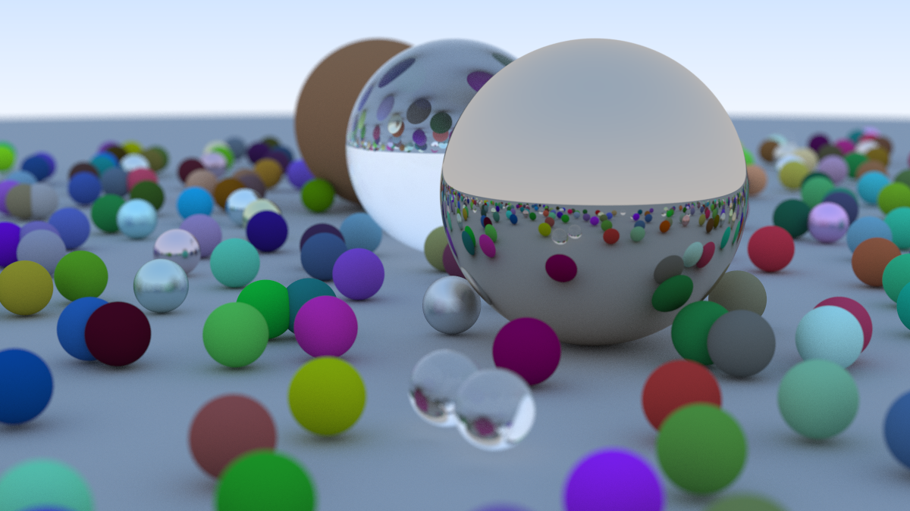
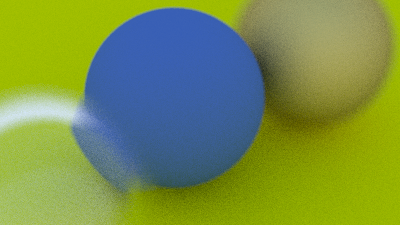
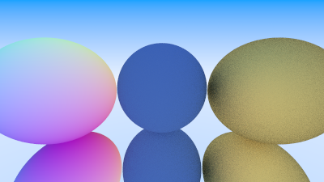

# Raytracing in One Weekend

Small C++ raytracer.

## Instructions

Generate with `cmake -S . -B build`.

Build and run with `cmake --build build && build/raytracing_in_one_weekend.exe build/output.png` (remove `.exe` if not building on Windows).

## Resources

[_Ray Tracing in One Weekend_](https://raytracing.github.io/books/RayTracingInOneWeekend.html)

## Samples

